# Deep Sleep
>User friendly meditation app aimed at improving sleep quality and promoting overall mental wellness. 

## Screenshots
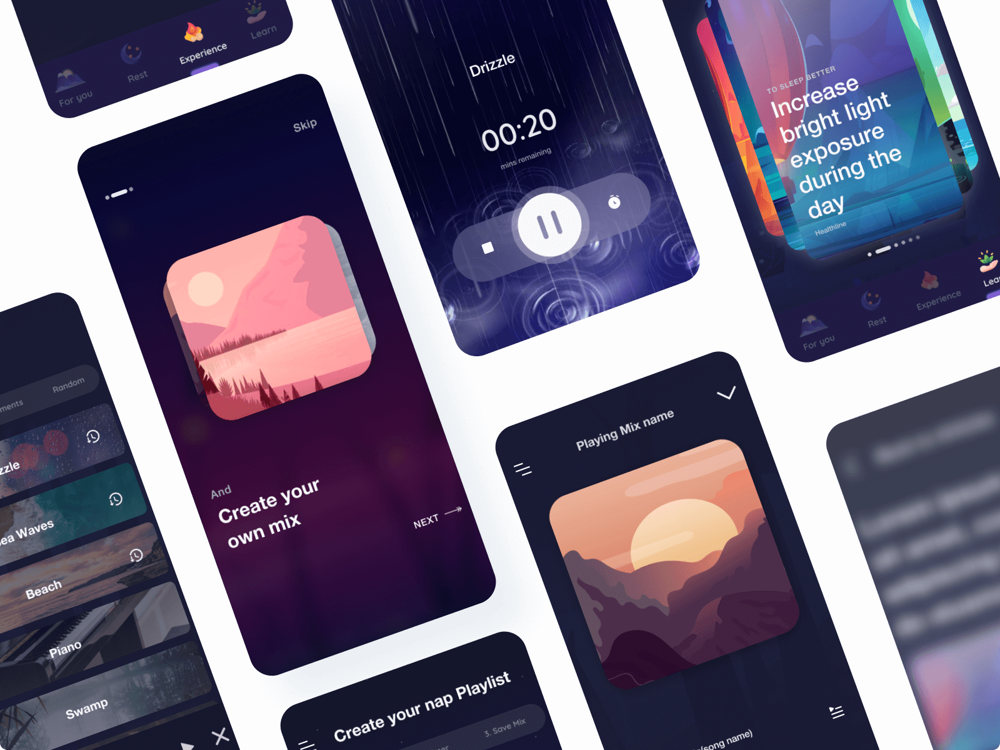

| **Dashboard** | **Rest** | **Playlists and downloads** |
  | :---: | :---: | :---: |
  | <kbd>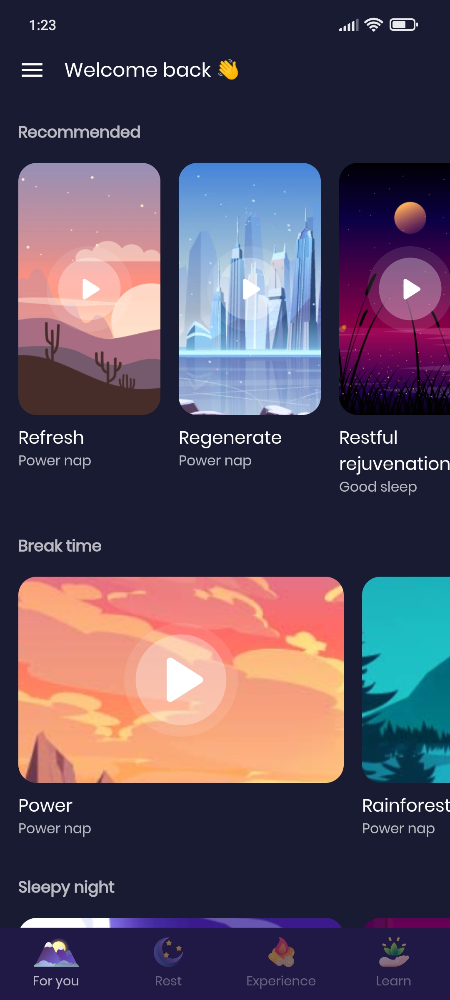</kbd> | <kbd>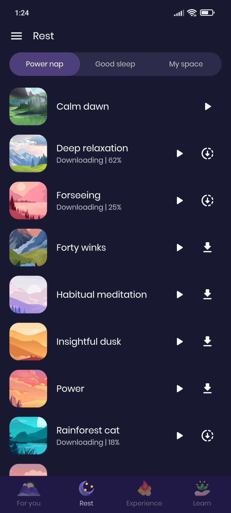</kbd> | <kbd>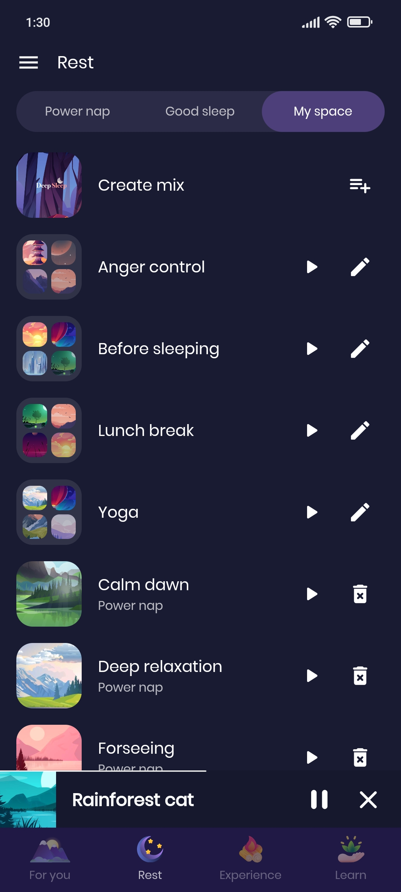</kbd> |
  | **Speed options** | **Rest player** | **Sleep timer** |
  | <kbd>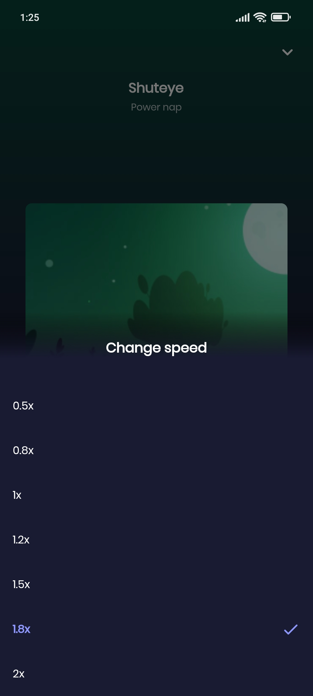</kbd> | <kbd>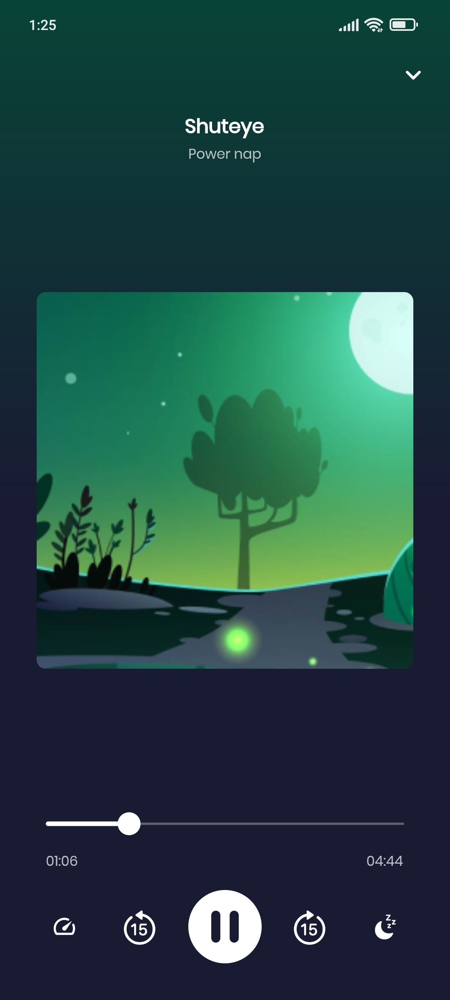</kbd> | <kbd>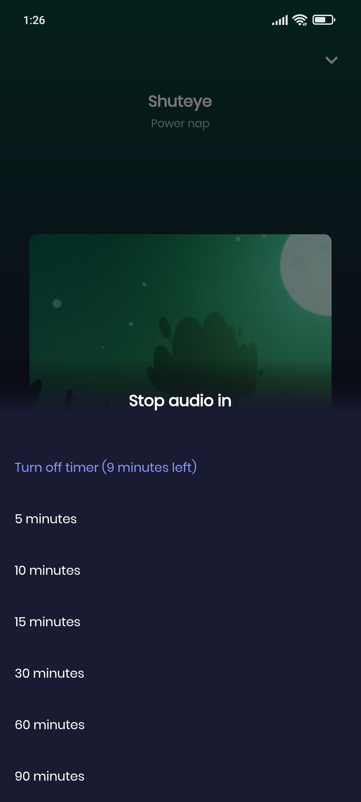</kbd> |
  | **Experience** | **Experience player** | **Sleep timer** |
  | <kbd>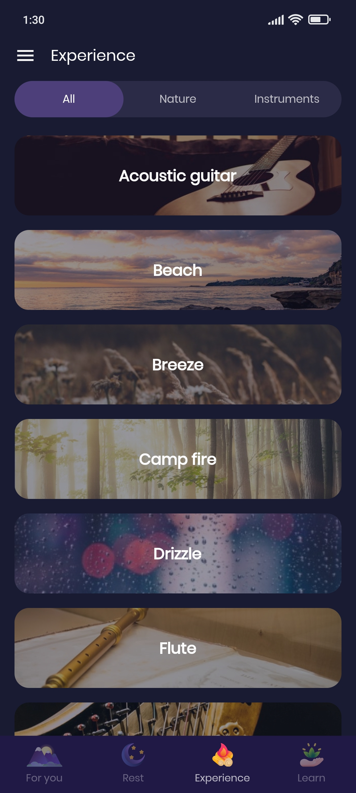</kbd> | <kbd>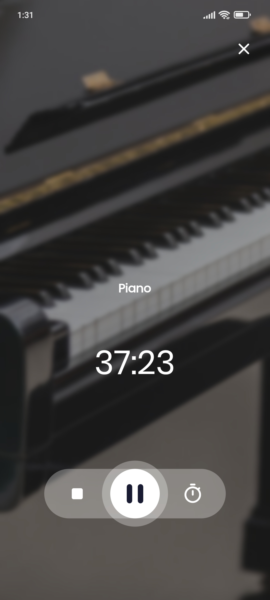</kbd> | <kbd>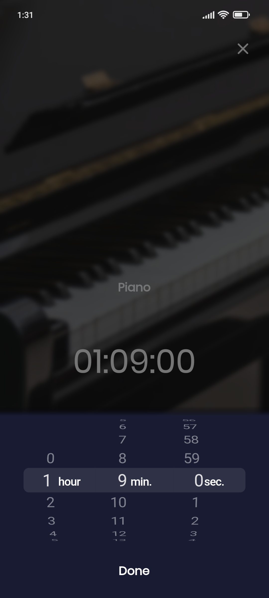</kbd> |
  | **Tips** | **Articles** | **Terminology** |
  | <kbd>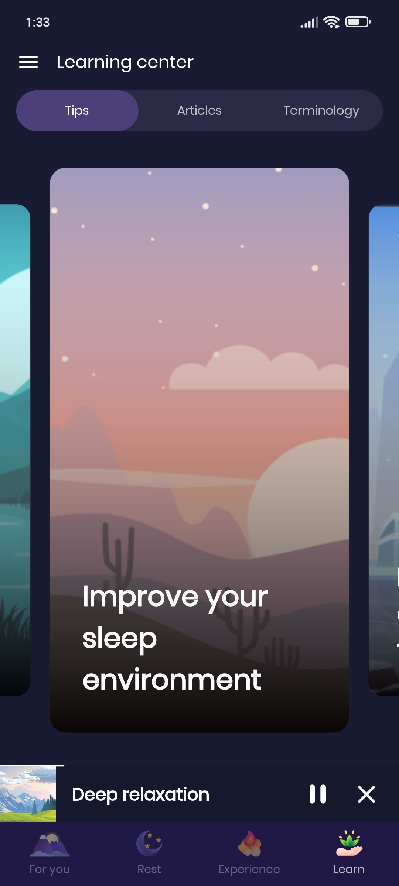</kbd> | <kbd>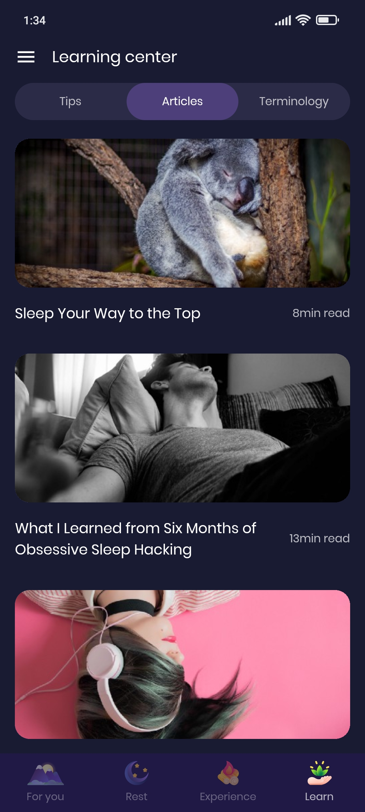</kbd> | <kbd>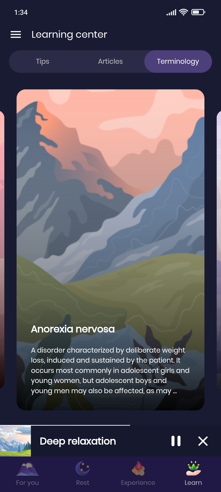</kbd> |

## Built with
[Flutter](https://github.com/flutter/flutter) and [Firebase](https://firebase.google.com/)
